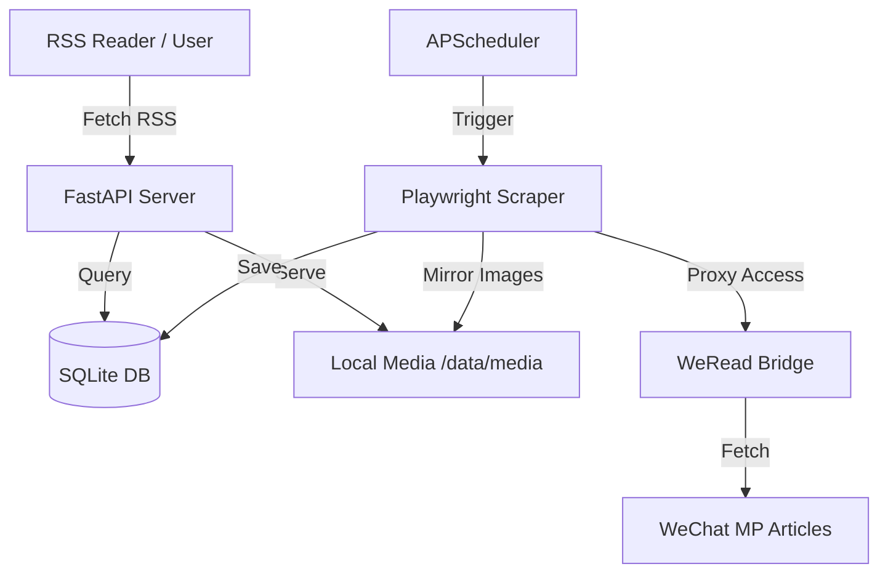

# Architecture

WeChatRSS is built with a modern Python stack designed for efficiency and stealth.

## System Overview

## Component Breakdown

### 1. Backend (FastAPI)
The core server handles:
*   **Dashboard:** A Jinja2-based web interface for administrators and users.
*   **User Management:** Secure password hashing (Bcrypt) and session handling.
*   **RSS Generation:** Dynamic generation of XML feeds with rewritten image paths.
*   **Static Asset Serving:** Serving locally mirrored images from `/media`.

### 2. Automation (Playwright)
Uses the Chromium engine to perform browser-based scraping. This approach is superior to simple HTTP requests because:
*   It executes JavaScript (required for WeChat's lazy loading).
*   It maintains session persistence via `state.json`.
*   It mimics human behavior through scrolling and interaction.

### 3. Storage (SQLite)
A lightweight database storing:
*   **Users:** Credentials and private RSS hashes.
*   **Accounts:** Tracked WeChat Official Accounts.
*   **Articles:** A global cache of full-text articles and metadata.
*   **Settings:** Scraper configuration (intervals, user-agents, stealth toggles).

### 4. Media Mirroring
To prevent broken images (due to WeChat's hotlink protection), the system:
1.  Downloads all images during scraping.
2.  Stores them locally with MD5-based filenames to avoid duplicates.
3.  Rewrites article HTML to point to the local FastAPI media endpoint.
